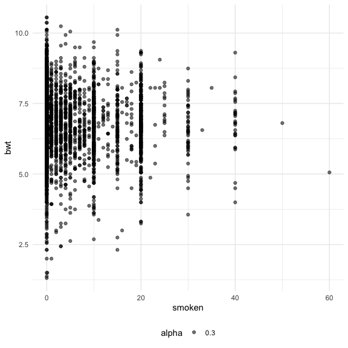

Homework 6
================
Nidhi Patel
12/9/2020

``` r
library(tidyverse)
```

    ## ── Attaching packages ─────────────────────────────────────── tidyverse 1.3.0 ──

    ## ✓ ggplot2 3.3.2     ✓ purrr   0.3.4
    ## ✓ tibble  3.0.3     ✓ dplyr   1.0.2
    ## ✓ tidyr   1.1.2     ✓ stringr 1.4.0
    ## ✓ readr   1.3.1     ✓ forcats 0.5.0

    ## ── Conflicts ────────────────────────────────────────── tidyverse_conflicts() ──
    ## x dplyr::filter() masks stats::filter()
    ## x dplyr::lag()    masks stats::lag()

``` r
library(modelr)
library(mgcv)
```

    ## Loading required package: nlme

    ## 
    ## Attaching package: 'nlme'

    ## The following object is masked from 'package:dplyr':
    ## 
    ##     collapse

    ## This is mgcv 1.8-33. For overview type 'help("mgcv-package")'.

``` r
library(p8105.datasets)
library(patchwork)

knitr::opts_chunk$set(
  fig.width = 6,
  fig.height = 6,
  out.width = "90%")

theme_set(theme_minimal() + theme(legend.position = "bottom"))

options(
  ggplot2.continuous.colour = "viridis",
  ggplot2.continuous.fill = "viridis"
)

scale_colour_discrete = scale_colour_viridis_d
scale_fill_discrete = scale_fill_viridis_d
```

## Problem 1

#### Read in Data + make vars we want

``` r
homicide = read_csv("./data/homicide-data.csv") %>% 
  unite(city_state, c("city", "state"), sep = "_") %>% 
  filter(city_state != "Tulsa_AL",
         victim_race %in% c("White", "Black"),
         victim_age != "Unknown") %>% 
  mutate(victim_age = as.numeric(victim_age),
         resolution = ifelse(disposition == "Closed by arrest", rep("1"), "0"), 
         resolution = as.factor(resolution))
```

    ## Parsed with column specification:
    ## cols(
    ##   uid = col_character(),
    ##   reported_date = col_double(),
    ##   victim_last = col_character(),
    ##   victim_first = col_character(),
    ##   victim_race = col_character(),
    ##   victim_age = col_character(),
    ##   victim_sex = col_character(),
    ##   city = col_character(),
    ##   state = col_character(),
    ##   lat = col_double(),
    ##   lon = col_double(),
    ##   disposition = col_character()
    ## )

``` r
#1 is traditionally results in successvictim_sex = as.factor(victim_sex),
```

This dataset contains 12 variables with 39403 observations. Each
homicide is distinguished by an unique id, contains basic demographic
information about the victim, the location and reported date of the
murder, and whether an arrest was made.

#### Fit GLM for Baltimore

``` r
bal_fit = homicide %>% 
  filter(city_state != "Baltimore_MD")
  glm(resolution ~ victim_age + victim_sex + victim_race, data = homicide, family = binomial()) %>% 
  broom::tidy() %>% 
  mutate(
    OR = exp(estimate),
    ci_upper = exp(estimate + 1.96 * std.error),
    ci_lower = exp(estimate - 1.96 * std.error)
  ) %>% 
    select(term, OR, starts_with("ci"))
```

    ## # A tibble: 5 x 4
    ##   term                 OR ci_upper ci_lower
    ##   <chr>             <dbl>    <dbl>    <dbl>
    ## 1 (Intercept)       1.43     1.54     1.33 
    ## 2 victim_age        0.998    0.999    0.996
    ## 3 victim_sexMale    0.603    0.639    0.569
    ## 4 victim_sexUnknown 0.926    1.72     0.498
    ## 5 victim_raceWhite  1.83     1.94     1.73

``` r
  ## NEEDS TO BE ADJUSTED OR for RACE
```

#### Map glm across cities

``` r
city_mod_results = 
  homicide %>% 
  nest(data = -city_state) %>% 
  mutate(
    models = map(.x = data, ~glm(resolution ~ victim_age + victim_sex + victim_race, data = .x, family = binomial())),
    results = map(models, broom::tidy)
  ) %>% 
  select(city_state, results) %>%
  unnest(results) %>% 
  mutate(
    OR = exp(estimate),
    ci_upper = exp(estimate + 1.96 * std.error),
    ci_lower = exp(estimate - 1.96 * std.error)
  ) %>% 
    filter(term == "victim_raceWhite") %>% 
  select(city_state, OR, starts_with("ci"))
```

#### Create plot

``` r
OR_plots = city_mod_results %>% 
  mutate(
    city_state = as_factor(city_state),
    city_state = fct_reorder(city_state, OR)
  ) %>% 
  ggplot(aes(x = city_state, y = OR, color = city_state)) +
  geom_point(alpha = 3) +
  geom_errorbar(aes(ymax = ci_upper, ymin = ci_lower)) +
  theme(legend.position = "none", axis.text.x = element_text(angle = 90)) +
  labs(title = "OR and CI of solving homicides comparing non-white victims to white victims"
  ) 

OR_plots
```


We have a plot of odds ratios comparing white homicide victims to black
homicide victims. From this plot we see that odds ratios for almost all
cities are greater than 1. This indicates the odds of having an solved
case among white victims is much greater than the odds of having a solve
case among black victims. However, a little less than half the cities
have a confidence interval that overlaps with 1, indicating there is no
difference in having a case solved between victims who are black or
white. Boston, Omaha and Oakland have very high odds ratios between
resolved murders between white and black victim, where white victims are
much more likely to be resolved.

## Problem 2

#### Read in data and clean

birthweight is now in lbs.

``` r
birthweight = read_csv("./data/birthweight.csv") %>% 
  mutate(babysex = as.factor(babysex),
         bwt = bwt / 454)
```

    ## Parsed with column specification:
    ## cols(
    ##   .default = col_double()
    ## )

    ## See spec(...) for full column specifications.

#### Explore for my model

``` r
birthweight %>% 
  ggplot(aes(x = babysex, y = bwt)) + 
  geom_violin()
```


``` r
birthweight %>% 
  ggplot(aes(x = fincome, y = bwt)) + 
  geom_point(aes(alpha = 0.3))
```


``` r
birthweight %>% 
  ggplot(aes(x = wtgain, y = bwt)) + 
  geom_point(aes(alpha = 0.3))
```


``` r
birthweight %>% 
  ggplot(aes(x = smoken, y = bwt)) + 
  geom_point(aes(alpha = 0.3))
```


I chose these variables from a combination of literature, exploratory
visualizations and pure interest. From visualizations, it looks like
there is a slight difference in birthweight between male and female
babies. I hypothesize that there is some connection between weight gain
and baby weight. Finally, there is literature that supports maternal
smoking and socioeconomic influence on health and contribution to
birthweight. I will develop a regression model to evaluate whether there
is a influence of sex, income smoking and weight gain on birthweight.

#### Fit my model

``` r
my_mod = lm(bwt ~ babysex + fincome + wtgain + smoken, data = birthweight) 

my_mod %>% 
  broom::tidy() %>% 
  knitr::kable()
```

| term        |    estimate | std.error |  statistic | p.value |
| :---------- | ----------: | --------: | ---------: | ------: |
| (Intercept) |   6.1226333 | 0.0497448 | 123.080888 |   0e+00 |
| babysex2    | \-0.1754709 | 0.0325204 | \-5.395715 |   1e-07 |
| fincome     |   0.0071402 | 0.0006273 |  11.382480 |   0e+00 |
| wtgain      |   0.0257765 | 0.0014852 |  17.355345 |   0e+00 |
| smoken      | \-0.0148283 | 0.0022004 | \-6.738808 |   0e+00 |

From this linear regression, we see baby sex, financial income, weight
gain and smoking have p-values lower than 0.05, and are considered
significant.

#### Look at residuals

``` r
birthweight %>% 
  modelr::add_residuals(my_mod) %>% 
  ggplot(aes(x = babysex, y = resid)) + 
  geom_violin() 
```


``` r
birthweight %>% 
  modelr::add_residuals(my_mod) %>% 
  modelr::add_predictions(my_mod) %>% 
  ggplot(aes(x = pred, y = resid)) + 
  geom_point(alpha = 0.3) 
```


#### Explore c

``` r
birthweight %>% 
  ggplot(aes(x = blength, y = bwt)) + 
  geom_point(aes(alpha = 0.3))
```


``` r
birthweight %>% 
  ggplot(aes(x = gaweeks, y = bwt)) + 
  geom_point(aes(alpha = 0.3))
```


#### Fit models

## Problem 3

#### Download data

``` r
weather_df = 
  rnoaa::meteo_pull_monitors(
    c("USW00094728"),
    var = c("PRCP", "TMIN", "TMAX"), 
    date_min = "2017-01-01",
    date_max = "2017-12-31") %>%
  mutate(
    name = recode(id, USW00094728 = "CentralPark_NY"),
    tmin = tmin / 10,
    tmax = tmax / 10) %>%
  select(name, id, everything())
```

    ## Registered S3 method overwritten by 'hoardr':
    ##   method           from
    ##   print.cache_info httr

    ## using cached file: /Users/madhusudhanpatel/Library/Caches/R/noaa_ghcnd/USW00094728.dly

    ## date created (size, mb): 2020-10-05 13:38:35 (7.522)

    ## file min/max dates: 1869-01-01 / 2020-10-31

#### visualizatons: Use tmin to predict tmax

``` r
weather_df %>% 
  ggplot(aes(x = tmin, y = tmax)) +
  geom_point()
```


It looks prettty linear.

#### Bootstrap 10 values

``` r
weather_boot_results = weather_df %>%
  bootstrap(10, id = "num") %>% 
  mutate(
    models = map(.x = strap, ~lm(tmax ~ tmin, data = .x)), 
    results = map(models, broom::tidy),
    rsq = map(models, broom::glance)
  ) %>% 
  select(num, results, rsq) %>% 
  unnest(num, results, rsq)
```

    ## Warning: unnest() has a new interface. See ?unnest for details.
    ## Try `df %>% unnest(c(num, results, rsq))`, with `mutate()` if needed

#### Find estimates of rsq and log

``` r
weather_boot_estimates = weather_boot_results %>% 
  select(num, term, estimate, r.squared) %>% 
  pivot_wider(
    names_from = "term",
    values_from = "estimate"
  ) %>% 
  rename(intercept = "(Intercept)") %>% 
  mutate(log_val = log(tmin * intercept))
```

#### Plot estimates

``` r
rsquared = weather_boot_estimates %>% 
  ggplot(aes(x = r.squared)) +
  geom_density()

logval = weather_boot_estimates %>% 
  ggplot(aes(x = log_val)) +
  geom_density()

rsquared + logval
```


#### Quantiles

``` r
weather_boot_quantiles = weather_boot_estimates %>% 
  summarize(
    ci_lower_r = quantile(r.squared, 0.025),
    ci_upper_r = quantile(r.squared, 0.075),
    ci_lower_log = quantile(log_val, 0.025),
    ci_upper_log = quantile(log_val, 0.075)
  )

knitr::kable(weather_boot_quantiles)
```

| ci\_lower\_r | ci\_upper\_r | ci\_lower\_log | ci\_upper\_log |
| -----------: | -----------: | -------------: | -------------: |
|    0.9017204 |    0.9029497 |        1.98156 |       1.984588 |
